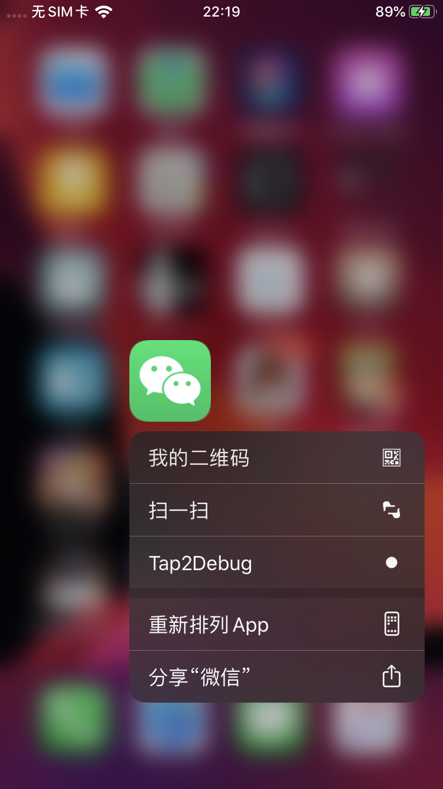
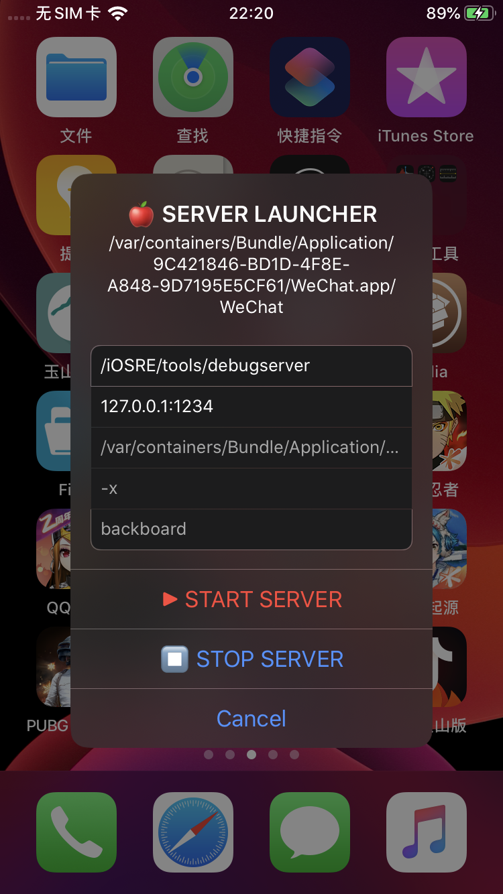

# Tap2Debug
tap shortcut to debug app (support iOS11/12/13/14 and A12)

### Install

- compile deb from source code

#### or

- install from cydia repo https://repo.byteage.com

### Screenshots

### Credit

- http://iosre.com/t/springboard-tweak-debugserver/16420
- https://github.com/4ch12dy/Tap2Debug
